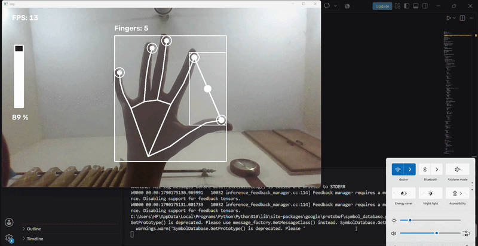

# Hand Gesture Volume Control

A real-time computer vision project that allows users to control their **Windows system volume using hand gestures**.

The project uses **MediaPipe Hand Tracking** to detect hand landmarks and **OpenCV** to process the webcam feed. The distance between the **thumb tip** and **index finger tip** is calculated and mapped to the Windows system volume using **Pycaw**.

## Demo



**Full Demo Video:** [volume_hand_control_demo.mp4](Output/volume_hand_control_demo.mp4)

## Features

* Real-time hand detection using a webcam
* Tracks 21 hand landmarks using MediaPipe
* Detects the thumb and index finger
* Calculates the distance between the thumb and index finger
* Maps finger distance to system volume
* Displays the current volume percentage
* Includes a real-time FPS counter
* Smooths hand landmark movement using interpolation
* Displays a visual hand skeleton
* Displays fingertip markers
* Displays a connection line between the thumb and index finger
* Displays a center point between the fingers
* Displays a vertical volume bar
* Displays a hand bounding box
* Counts detected fingers
* Shows a visual indicator when the fingers are very close
* Uses Pycaw to control Windows system audio

## How It Works

The basic workflow of the project is:

```text
Webcam
   ↓
OpenCV captures video
   ↓
MediaPipe detects hand
   ↓
21 hand landmarks are extracted
   ↓
Thumb + Index Finger positions are identified
   ↓
Distance between fingers is calculated
   ↓
Distance is mapped to the volume range
   ↓
Pycaw changes Windows system volume
   ↓
Volume level and visual feedback are displayed
```

## Gesture Control

The distance between the **thumb tip** and **index finger tip** controls the system volume.

* Move fingers closer → Lower volume
* Move fingers farther apart → Higher volume
* When the fingers are very close, a visual indicator appears on the screen

The project mainly uses these MediaPipe landmarks:

```text
Landmark 4 → Thumb tip
Landmark 8 → Index finger tip
```

## Technologies Used

* **Python** — Main programming language
* **OpenCV** — Webcam capture, image processing, and visual interface
* **MediaPipe** — Hand landmark detection
* **NumPy** — Distance-to-volume interpolation
* **Pycaw** — Windows system volume control
* **Comtypes** — Windows audio interface interaction
* **Math** — Distance calculation between hand landmarks

## Project Structure

```text
Hand-Gesture-Volume-Control/
│
├── HandTrackingModule.py
├── VolumeHandControl.py
├── README.md
├── .gitignore
│
└── output/
    ├── volume_hand_control_demo.gif
    └── volume_hand_control_demo.mp4
```

### `HandTrackingModule.py`

This module contains the custom `handDetector` class.

It is responsible for:

* Initializing MediaPipe Hands
* Detecting hands
* Extracting 21 hand landmarks
* Detecting left/right hand type
* Smoothing landmark movement
* Drawing the hand skeleton
* Drawing fingertip markers
* Drawing the hand bounding box
* Counting detected fingers
* Displaying the finger count

### `VolumeHandControl.py`

This is the main application.

It:

1. Opens the webcam.
2. Initializes the hand detector.
3. Detects the hand using `HandTrackingModule`.
4. Gets the thumb and index finger landmarks.
5. Calculates the distance between them.
6. Maps the distance to the Windows volume range.
7. Changes the system volume using Pycaw.
8. Displays the volume bar and percentage.
9. Displays the FPS counter.
10. Provides visual feedback for the hand gesture.

## Requirements

* Windows operating system
* Python 3.x
* Webcam
* Webcam access permission
* Working Windows audio output device

## Python Libraries

Install the required libraries:

```bash
pip install opencv-python mediapipe numpy pycaw comtypes
```

## Installation

### 1. Clone the Repository

```bash
git clone <your-github-repository-url>
```

### 2. Open the Project Folder

```bash
cd Hand-Gesture-Volume-Control
```

### 3. Install Dependencies

```bash
pip install opencv-python mediapipe numpy pycaw comtypes
```

### 4. Run the Project

```bash
python VolumeHandControl.py
```

A webcam window should open and display the detected hand.

## Usage

After starting the program:

1. Show one hand in front of the webcam.
2. Make sure the thumb and index finger are visible.
3. Move the thumb and index finger closer together to decrease the volume.
4. Move them farther apart to increase the volume.
5. Observe the volume percentage and volume bar on the screen.
6. Press **Q** to exit the application.

## Volume Mapping

The project maps the distance between the thumb and index finger to the Windows system audio volume range.

The current gesture distance range is:

```text
50 pixels  → Minimum volume
300 pixels → Maximum volume
```

The distance is interpolated between these values and converted into the Windows audio volume range obtained through Pycaw.

## Visual Interface

The application displays:

* Hand skeleton
* Fingertip markers
* Thumb-to-index connection line
* Center point between the fingers
* Hand bounding box
* Finger count
* Volume percentage
* Vertical volume bar
* FPS counter
* Visual indicator when the fingers are very close

## Hand Tracking

MediaPipe provides **21 landmarks** for each detected hand.

Some of the landmarks used by this project are:

```text
Landmark 0  → Wrist
Landmark 4  → Thumb tip
Landmark 8  → Index finger tip
Landmark 12 → Middle finger tip
Landmark 16 → Ring finger tip
Landmark 20 → Pinky tip
```

The volume-control functionality mainly uses:

```text
Landmark 4 → Thumb tip
Landmark 8 → Index finger tip
```

The distance between these two landmarks determines the volume level.

## Smoothing

To make the hand tracking more stable, the project applies landmark smoothing.

A smoothing factor of **0.4** is used to gradually move the detected landmark position toward the newly detected position instead of immediately jumping to it.

This helps reduce small movements and makes the hand skeleton and gesture interaction appear smoother.

## Close-Finger Indicator

When the distance between the thumb and index finger is below **50 pixels**, a visual indicator appears at the center point between the two fingers.

This provides immediate visual feedback when the gesture reaches the minimum distance.

## Windows Audio Control

The project uses **Pycaw** to communicate with the Windows audio endpoint and control the master system volume.

Because Pycaw relies on Windows audio APIs, the system-volume control functionality is intended for **Windows**.

The hand-tracking component is separate from the Windows-specific volume-control functionality.

## Initial Volume

When the application starts, the system volume is initially set to a fixed level before gesture-based control begins.

```text
Initial volume level → -20.0 dB
```

After that, the thumb-to-index finger distance continuously controls the volume.

## Possible Improvements

Future improvements could include:

* Add mute/unmute gesture
* Add media play/pause gestures
* Add next/previous track gestures
* Add brightness control
* Add gesture-based application controls
* Add a graphical user interface
* Add configurable minimum and maximum gesture distances
* Improve gesture detection
* Add support for multiple gesture commands
* Improve tracking stability and responsiveness

## Author

**Mehroz Shahid**

Computer Science Student

Interested in AI, Machine Learning, Computer Vision, and AI Engineering.
